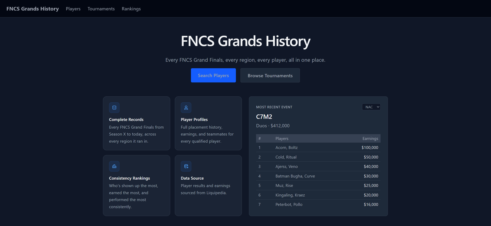
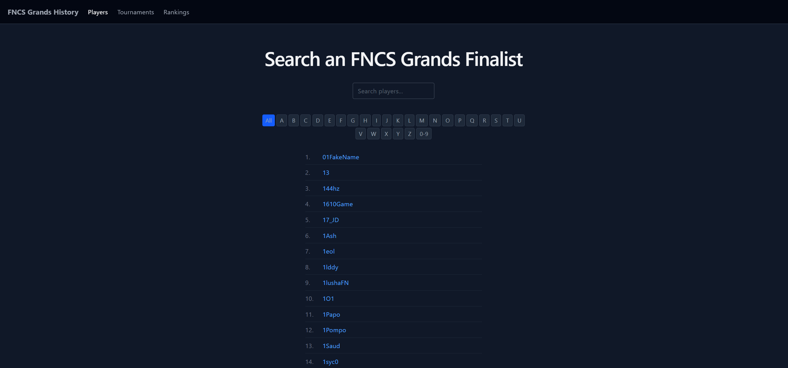
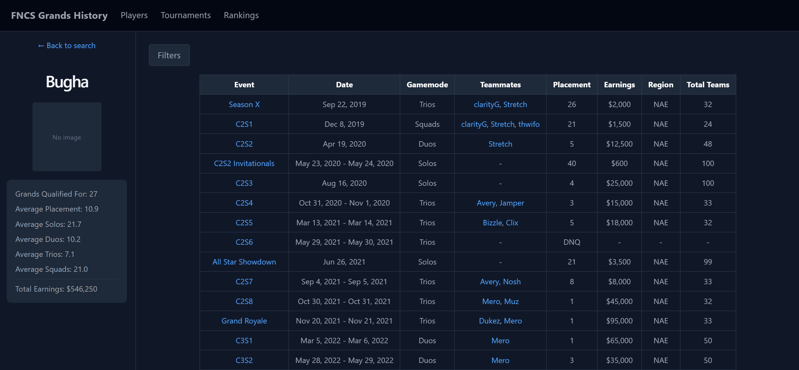
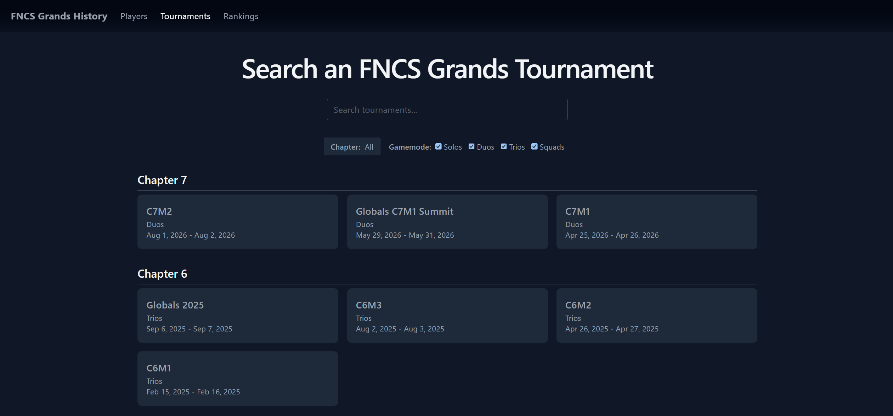
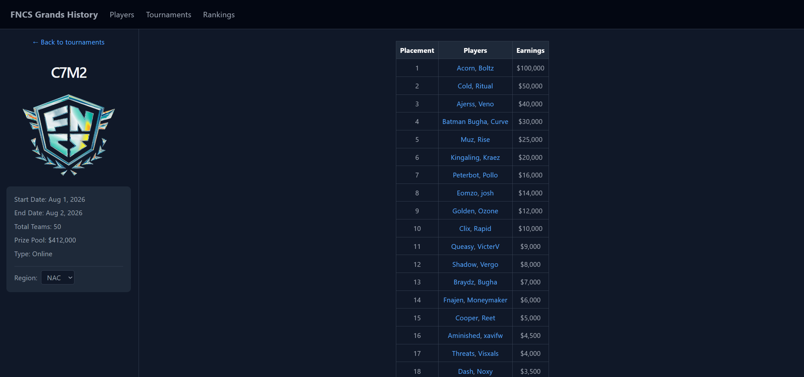
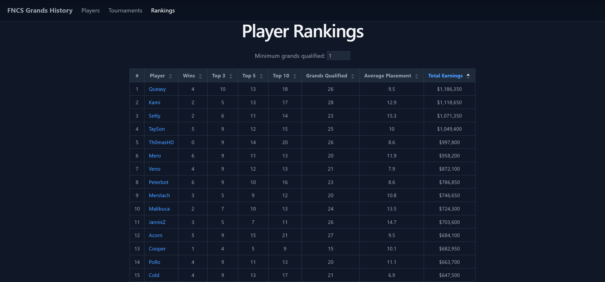

# FNCS Grands History

A full-stack site tracking every FNCS Grand Finals iteration in Fortnite competitive history, including every region it ran in, and every player that's qualified for a grand finals.

**Live site:** 

## Overview

FNCS Grands History scrapes tournament results directly from Liquipedia, normalizes them into a relational database, and displays them through a searchable and filterable web app. It covers every Grand Finals from Season X to the latest one (C7M2 as of writing this), across every possible region, with full player profiles, tournament pages, and a sortable player rankings leaderboard. Updated after every FNCS too!

## What is FNCS?

FNCS (Fortnite Champion Series) is a highest-stakes Fortnite tournament that first began in Season X. It's split across multiple regions (usually seven) and typically runs once per Fortnite season. Naming conventions have shifted over time: C2S3 refers to Chapter 2 Season 3, while C5M2 refers to Chapter 5 Major 2 (seasons started being called "majors" starting Chapter 4). Format, gamemodes, and tournament point systems have also changed across chapters, but every iteration has consisted of a set of qualifying rounds followed by a grand finals.

FNCS carries heavy weight in competitive Fortnite's ongoing GOAT (greatest of all time) discussions, since grand finals wins and exceptional placements results can be legacy-defining. However, win totals alone don't tell the full story. The players with the most and second-most FNCS wins come from regions generally considered less competitive, and their totals aren't weighted the same in most GOAT conversations as a result. Other extraneous situations include some winners have also been carried by significantly better teammates, some tournament winners weren't even considered the best team going in (prior results had other favorites who simply didn't perform on the day), and the individual best player in a given tournament isn't always apart of the winning team. Overall, placement numbers alone aren't always the best metric when defining greatenss. The region, prior placements leading up to FNCS, landing spot (loot quality varies significantly by location each season), and in-match performance (a players match statistics) should all be factored in as well.

## Limitations

- Only grand finals leaderboards are scraped. In some past iterations, players could also earn money during the qualifying rounds themselves, but that data isn't accounted for.
- In-match performance stats (damage, eliminations, etc.) aren't tracked, only final placements and earnings.
- Some data-quality issues in the underlying Liquipedia records (like disqualified teams affecting posted placements) have been manually corrected where found, but the dataset covers hundreds of tournaments across many years and there's no guarantee every edge case has been caught.

## Features

- Search and browse every player who's ever qualified for an FNCS Grand Finals
- Full player profile pages with placement history, teammates, earnings, and per-gamemode averages, filterable by gamemode, date range, and qualification status
- Browse tournaments by chapter with gamemode filtering
- Individual tournament pages with full leaderboards and region switching
- Player rankings sortable by wins, top finishes, average placement, and total earnings
- Handles edge cases from Liquipedia's records, including disqualified teams, redlinked players without wiki pages, and lans that invited more teams than could fit in the actual grand finals lobby

## Screenshots

<table>
  <tr>
    <td></td>
    <td></td>
    <td></td>
  </tr>
  <tr>
    <td></td>
    <td></td>
    <td></td>
  </tr>
</table>

## Tech Stack

**Frontend:** React, TypeScript, Vite, Tailwind CSS, React Router  
**Backend/Database:** Supabase (PostgreSQL), Row Level Security, SQL views  
**Data Pipeline:** Python, BeautifulSoup, requests  
**Hosting:** Cloudflare Pages

## Project Structure

```text
fncs-grands-history
├─ scraper/         Scraping pipeline (Liquipedia MediaWiki API)
├─ database/        SQL schemas & queries
├─ data/cleaned/    Scraped tournament results as CSVs
├─ src/             Frontend
└─ public/          Static assets
```

## Local Setup

### Prerequisites

- Node.js
- Python 3.10+
- A Supabase project

### Installation

**1. Clone the repository**

```bash
git clone https://github.com/aahmad-1/fncs-grands-history.git
cd fncs-grands-history
```

**2. Install frontend dependencies**

```bash
npm install
```

**3. Install scraper dependencies**

```bash
pip install -r requirements.txt
```

**4. Set up the database**

Create a new project in Supabase and run `database/schema.sql` in the SQL Editor to create all tables, policies, and views.

**5. Configure environment variables**

Create `.env` in the project root:

```env
DATABASE_URL=your_database_url
VITE_SUPABASE_URL=your_supabase_project_url
VITE_SUPABASE_ANON_KEY=your_supabase_anon_key
```

- Follow [this guide](https://www.youtube.com/watch?v=4gUx-S3X66M) to get the `DATABASE_URL`, replace `[YOUR PASSWORD]` with your database password
- Follow [this guide](https://www.youtube.com/watch?v=TDiOzWWTnaQ) to get the `VITE_SUPABASE_URL`, remove `/rest/v1/` from it
- Follow [this guide](https://www.youtube.com/watch?v=j3sSJJ_S1UQQ) to get the `VITE_SUPABASE_ANON_KEY`

### Running the app

```bash
npm run dev
```

Open http://localhost:5173 in your browser.

## Reproducing the Scrape

The scraper is fully configurable through `scraper/config.py`:

- **`USER_AGENT`** — set this to your own project name and contact info. Liquipedia requires a descriptive user agent on every request.
- **`LIQUIPEDIA_URLS`** — comment out any tournament URLs you don't want to scrape.
- **`NON_NA_REGIONS`** and **`REGION_URL_PARTS`** — comment out any regions you don't want to scrape.
- **`SLEEP_SECONDS`** — feel free to increase above 30, but do not decrease this. 30 seconds is needed to comply with Liquipedia's rate limits.

Before scraping, I suggest reading and following the [Liquipedia API Terms of Use](https://liquipedia.net/api-terms-of-use).

Once configured, run:

```bash
python scraper/main.py
```

Then load the scraped data into Supabase:

```bash
python database/load_data.py
```

## Acknowledgements

- [Liquipedia Fortnite](https://liquipedia.net/fortnite/) — the source of all tournament, player, and earnings data used in this project
- [react-icons](https://react-icons.github.io/react-icons/) for any icons used throughout the UI